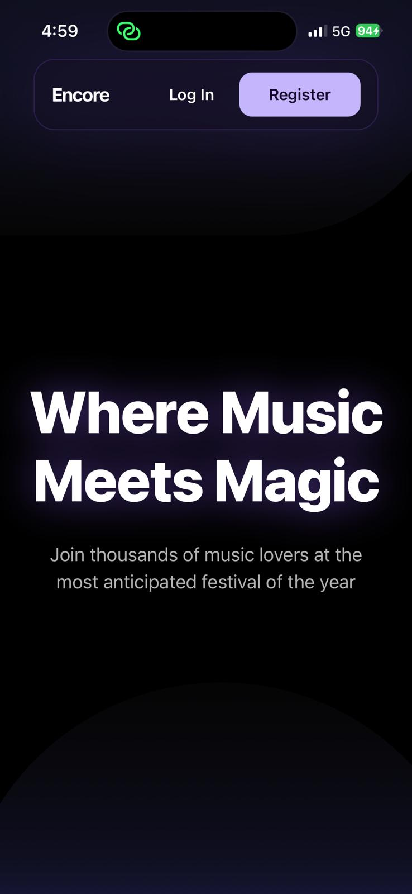
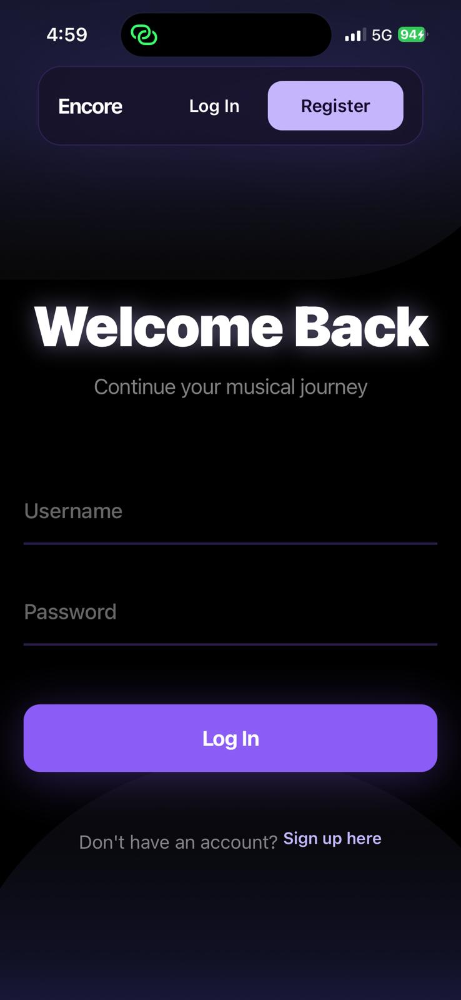
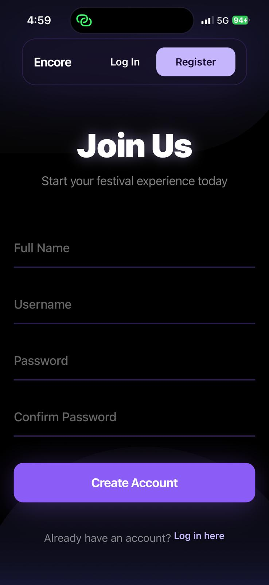
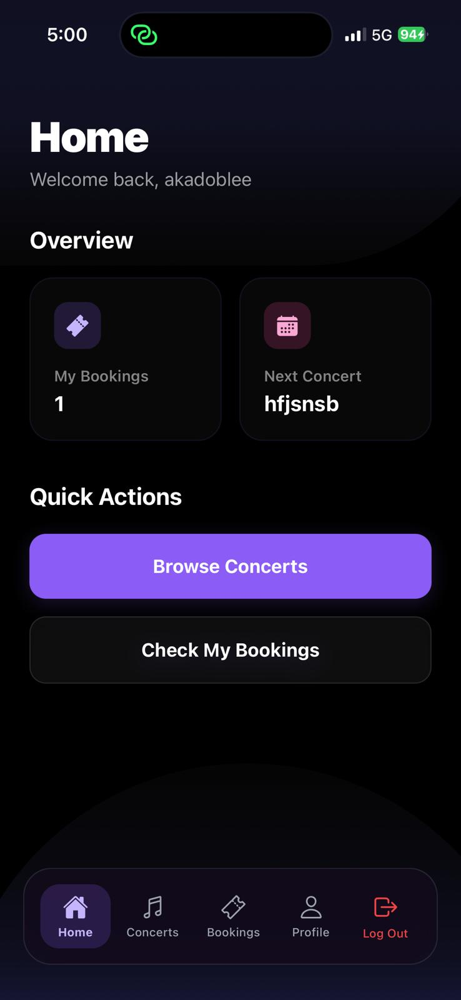
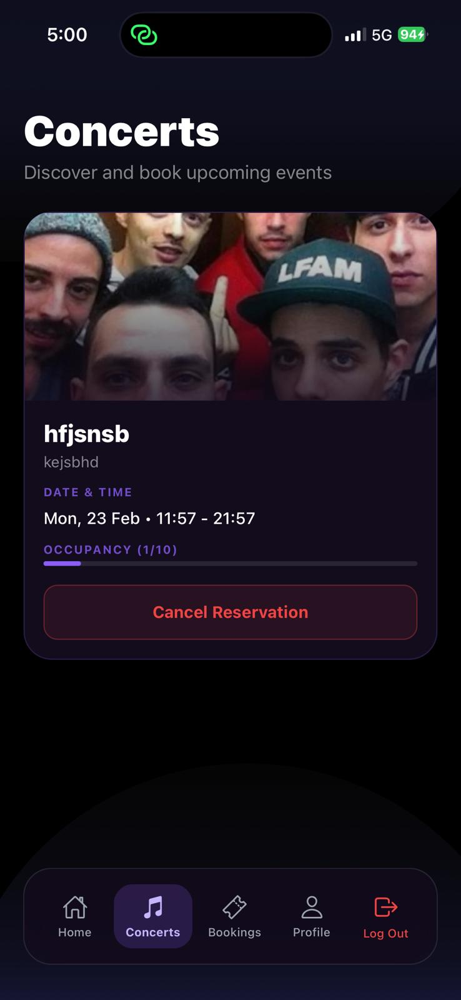
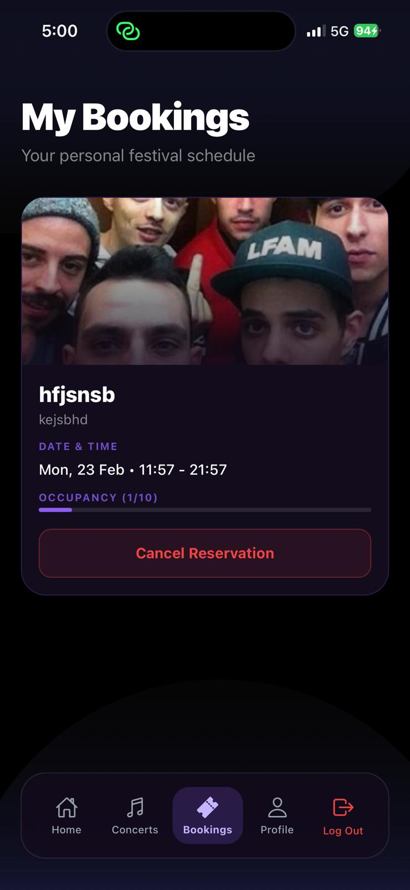
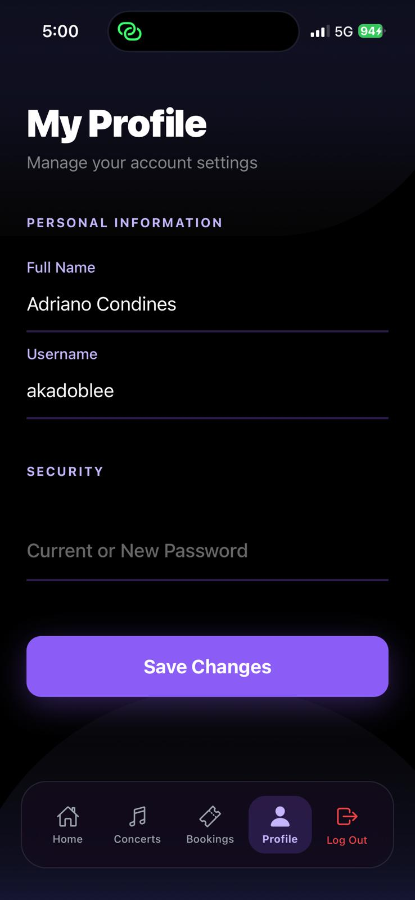
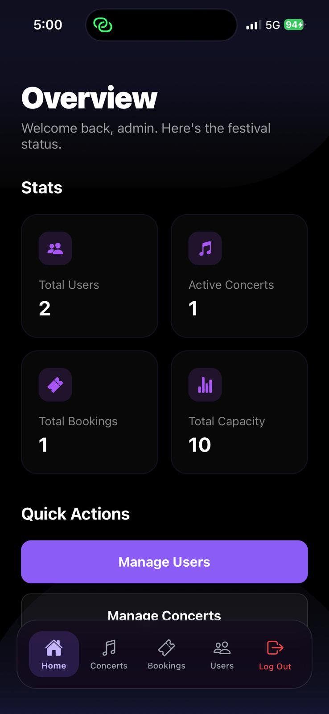

# ENCORE FESTIVAL - APP MÓVIL

Esta es la versión móvil de la aplicación del festival Encore. Esta aplicación permite a los usuarios ver los horarios de los conciertos, gestionar su perfil y reservar entradas para los eventos directamente desde sus dispositivos móviles (iOS y Android).

## Tecnologías Utilizadas

Para este proyecto se han utilizado las siguientes tecnologías para crear una aplicación móvil nativa, rápida y con una interfaz moderna:

- **React Native & Expo**: Framework principal para crear la aplicación móvil multiplataforma de forma ágil.
- **TypeScript**: Lenguaje de programación utilizado para asegurar un código robusto y tipado.
- **Python (Flask)**: Framework utilizado para construir la API REST del servidor (Backend).
- **MongoDB**: Base de datos no relacional para guardar los datos de usuarios, actividades y reservas.
- **Node.js & npm**: Entorno de ejecución y gestor de paquetes para el frontend móvil.

## Características

- Registro e inicio de sesión de usuarios seguro (mediante tokens JWT).
- Reserva y cancelación de entradas para conciertos (sistema que evita reservas duplicadas y controla el aforo).
- Panel de administración completo para crear, modificar o eliminar conciertos, gestionar usuarios registrados y consultar el registro global de actividad.

## Instalación del proyecto

Para instalar y ejecutar el proyecto móvil en tu entorno local, debes seguir estos pasos:

1. Clonar el repositorio.
2. Abrir una terminal en la carpeta del proyecto y ejecutar el comando `npm install` para instalar todas las dependencias.
3. Asegurarte de que el backend (servidor Flask) esté corriendo y actualizar la variable `API_BASE_URL` con la IP local de tu máquina.
4. Ejecutar el comando `npx expo start` para iniciar el servidor de desarrollo.
5. Escanear el código QR con la aplicación **Expo Go** (disponible en iOS y Android) para ver la app en tu teléfono físico o en un emulador.

## Vistas de la Aplicación

### Vista de Inicio

### Vista de Inicio de Sesión

### Vista de Registro

### Vista de Home

### Vista de Conciertos

### Vista de Mis Reservas

### Vista de Edición de Perfil

### Vista del Panel de Admin

## Diagramas de casos de uso
En este caso están representados los diagramas de casos de uso del registro de un usuario y de la reserva para un concierto.

